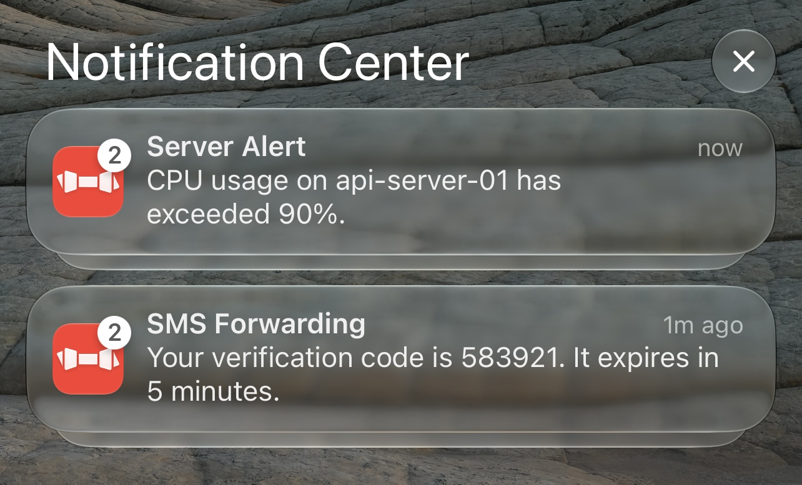
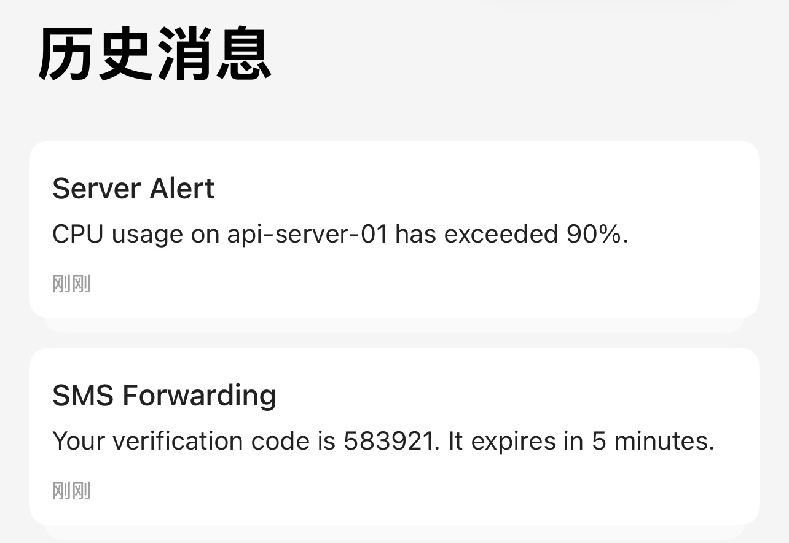
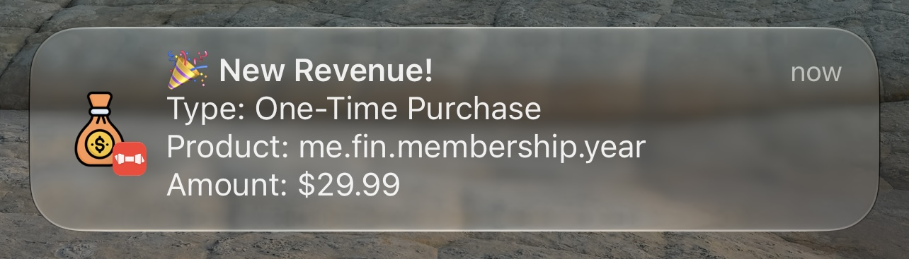
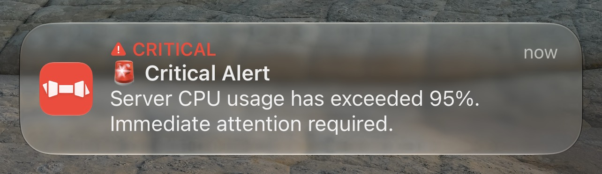

## Request Parameters
These parameters have the same names in GET queries, POST form bodies and JSON bodies, and can be combined as needed.

### Parameters
- Content
  - [title](#title) Push title
  - [subtitle](#subtitle) Push subtitle
  - [body](#body) Push content
  - [markdown](#markdown) Markdown content
- Device
  - [device_key](#device_key) Device key
  - [device_keys](#device_keys) Batch push
- Display & Grouping
  - [group](#group) Message group
  - [icon](#icon) Custom icon
  - [image](#image) Push image
  - [badge](#badge) App badge
- Alerts & Sounds
  - [level](#level) Interruption level
  - [volume](#volume) Critical alert volume
  - [call](#call) Repeating ringtone
  - [sound](#sound) Custom sound
- Copy & Actions
  - [copy](#copy) Content to copy
  - [url](#url) URL to open
  - [action](#action) Tap action popup
- Encryption
  - [ciphertext](#ciphertext) Encrypted push
  - [iv](#iv) Initialization vector
- Archiving & Management
  - [isArchive](#isarchive) Save to history
  - [ttl](#ttl) Retention time
  - [id](#id) Notification identifier
  - [delete](#delete) Delete notification

### Content
#### title
Push title, shown on the first line of the notification. 
If not passed, the notification only shows the body;

#### subtitle
Push subtitle, shown in smaller text below the title and above the body. Good for the source, status or other extra information. 
If not passed, this line is not shown;

#### body
Push content, the main text of the notification.

#### markdown
Push content with basic Markdown support. When this parameter is passed, body is ignored. 
Supports bold, italic, strikethrough, links, inline code, code blocks, headings 1-6, blockquotes, ordered/unordered lists and task lists; images fall back to link text in the notification. 
Please handle special characters in the content when sending.

### Device
#### device_key
The key of the target device, the same as the key in the URL path. 
For JSON requests to `/push`, use it to put the key in the request body, see the [Tutorial](/en-us/tutorial). 
This parameter is used by the server, the app itself does not read it.

#### device_keys
An array of keys, to push to multiple devices at once. Only supported in JSON requests, see [Batch Push](/en-us/batch). 
Up to 10 devices per request on the public server, no limit on a self-hosted server; requires bark-server v2.1.9 or above.

### Display & Grouping
#### group
Groups messages: pushes with the same `group` are put together in Notification Center and in the history list, as shown below. 
 
In the app's history list you can tap the switch button to view messages by group. 
 
You can also long press or pull down the notification banner to mute a group; a muted group will not light up the screen.

#### icon
Custom notification icon, set to an image URL, replacing the default Bark icon in the notification. 
The icon is cached on the device and the same URL is downloaded only once, so it still shows after the image URL becomes unavailable; if the first download takes more than 10 seconds, the default icon is used. 
Requires iOS 15 or above. 

#### image
URL of the push image. Expand the notification to see the full image, it is also shown in the app history. 
The image is cached on the device as well; if the download takes more than 10 seconds, the push is shown without the image.

#### badge
The badge number on the app icon. It is set to the value you pass, not added to the previous number. 
Passing `0` clears the badge and also clears the app's notifications from Notification Center.

### Alerts & Sounds
#### level
The interruption level of the push, possible values: 
- `active`: default, the system immediately lights up the screen and shows the notification
- `timeSensitive`: time-sensitive notification, can be shown in Focus mode
- `passive`: only adds the notification to the notification list, without lighting up the screen
- `critical`: critical alert, rings even in silent mode, as shown below

`critical` requires the critical alert permission in the app; without it the push is downgraded to a normal notification, and the ringtone volume is controlled by [volume](#volume). 
Requires iOS 15 or above. 

#### volume
Volume of the critical alert (`level=critical`), from 0 to 10, default is 5 if not passed. 
Only works for critical alerts; the volume of normal pushes is controlled by the system and is not affected by this parameter.

#### call
Pass `"1"` to loop the notification ringtone for 30 seconds (by default it rings only once), for situations that need a strong alert. 
Use [sound](#sound) to pick the ringtone; when used together with `level=critical`, the volume can be adjusted with [volume](#volume).

#### sound
Name of the ringtone to use, for example `minuet`. 
Both the built-in ringtones and your own imported ringtones can be used; an imported ringtone must be in `.caf` format and no longer than 30 seconds, see the sound settings in the app for how to import. 
If not passed, the default ringtone in the app settings is used; if the name does not exist, the system falls back to the default alert sound.

### Copy & Actions
#### copy
The content to copy when a push is copied, for example to copy only the verification code from the body. 
If not passed, the push body is copied;

#### url
URL to open when the push is tapped, supports URL Scheme and Universal Link. 
`http` / `https` links are opened with the Universal Link first and fall back to Safari; other schemes are handed to the system directly.

#### action
Pass `alert` to show an action popup when the push opens the app, where you can copy the push content or share it. 
Pass `none` and tapping the push only opens the app without navigating to a specific page; other values behave as default. 
When [url](#url) is also passed, `url` takes precedence.

### Encryption
#### ciphertext
Ciphertext of an encrypted push. The content is invisible to the Bark server and Apple APNs, only the app on your device can decrypt it. 
The ciphertext can contain `title`, `subtitle`, `body`, `sound`, `group`, `badge` and other parameters, see [Encryption](/en-us/encryption) for how to encrypt. 
If decryption fails, the notification shows `Decryption Failed`.

#### iv
Used for encrypted pushes. 
The random IV used while encrypting needs to be sent to the server together with the ciphertext;

### Archiving & Management
#### isArchive
Whether to save this push to the app history. Pass `1` to save, any other value not to save. 
If not passed, the setting in the app decides, and the default is to save.

#### ttl
Retention time of an archived push in seconds, only affects messages saved to history. 
After it expires, the app deletes the history entry and also removes the matching notification from Notification Center; 
Good for messages that only matter for a while, such as verification codes or temporary alerts.

#### id
Unique identifier of the notification. Using the same `id` updates and replaces the previous notification instead of stacking up in Notification Center, which suits progress or status notifications. 
Requires Bark v1.5.2 and bark-server v2.2.5 or above; in JSON requests it must be a string, numbers do not work. 
Deleting a notification ([delete](#delete)) also relies on it.

#### delete
Pass `"1"` to delete the specified notification, removing it from both Notification Center and the app history. Must be used with [id](#id). 
The command is delivered as a silent push, so "Background App Refresh" must be enabled for Bark in system settings, otherwise it does not work.
