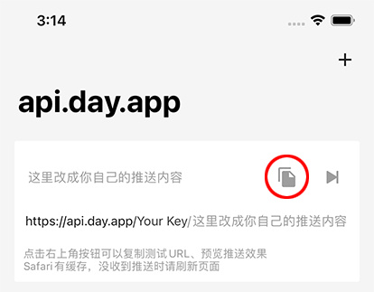

## Sending Push Notifications
1. Open the APP and copy the test URL. 



2. Modify the content and request this URL.<br>
You can send a GET or POST request. If the request is successful, you will receive the push notification immediately.

## URL Format
The URL consists of the push key, parameter title, parameter subtitle, and parameter body. There are three combinations:

```
/:key/:body 
/:key/:title/:body 
/:key/:title/:subtitle/:body 
```

## Request Methods
##### GET request parameters are appended to the URL, for example:
```sh
curl https://api.day.app/your_key/body?group=groupName&copy=copyText
```
*When manually appending parameters to the URL, please pay attention to URL encoding issues.*

##### POST request parameters are placed in the request body, for example:
```sh
curl -X POST https://api.day.app/your_key \
     -d'body=body&group=groupName&copy=copyText'
```
##### POST requests support JSON, for example:
```sh
curl -X "POST" "https://api.day.app/your_key" \
     -H 'Content-Type: application/json; charset=utf-8' \
     -d $'{
  "body": "Test Bark Server",
  "title": "Test Title",
  "badge": 1,
  "sound": "minuet",
  "icon": "https://day.app/assets/images/avatar.jpg",
  "group": "test",
  "url": "https://mritd.com"
}'
```

##### JSON request key can be placed in the request body, the URL path must be /push, for example:
```sh
curl -X "POST" "https://api.day.app/push" \
     -H 'Content-Type: application/json; charset=utf-8' \
     -d $'{
  "body": "Test Bark Server",
  "title": "Test Title",
  "device_key": "your_key"
}'
```

## Request Parameters
List of supported parameters, specific effects can be previewed in the APP.

| Parameter | Description |
| ----- | ----------- |
| title | Push title |
| subtitle | Push subtitle |
| body | Push content |
| device_key | Device key |
| device_keys | Key array, used for batch push |
| level | Push interruption level.<br>critical: Important alert, will ring even in silent mode <br>active：Default value, the system will immediately light up the screen to display the notification<br>timeSensitive：Time-sensitive notification, can display the notification in focus mode.<br>passive：Only adds the notification to the notification list, will not light up the screen. |
| volume | Important alert notification volume, value range: 0-10, default is 5 if not passed |
| badge | Push badge, can be any number |
| call | Pass "1" to repeat the notification ringtone |
| autoCopy | Pass "1" to automatically copy the push content on iOS14.5 and below, on iOS14.5 and above, you need to long press or pull down the push to copy |
| copy | When copying the push, specify the content to copy, if this parameter is not passed, the entire push content will be copied. |
| sound | Can set different ringtones for the push |
| icon | Set a custom icon for the push, the set icon will replace the default Bark icon. <br>The icon will be automatically cached on the device, the same icon URL will only be downloaded once. |
| group | Group messages, pushes will be displayed in the notification center by group.<br>You can also choose to view different groups in the history message list. |
| ciphertext | Ciphertext for encrypted push |
| isArchive | Pass 1 to save the push, pass other values to not save the push, if not passed, it will be decided by the APP settings whether to save. |
| url | URL to jump to when the push is clicked, supports URL Scheme and Universal Link |
| action | Pass "none" to prevent a popup when the push is clicked |
| id | When using the same ID value, it will update the corresponding push notification content<br>Requires Bark v1.5.2, bark-server v2.2.5 or above |
| delete | Pass "1" to delete the notification from the system notification center and APP history, must be used with the id parameter<br>Requires "Background App Refresh" to be enabled in settings, otherwise it will not work. |