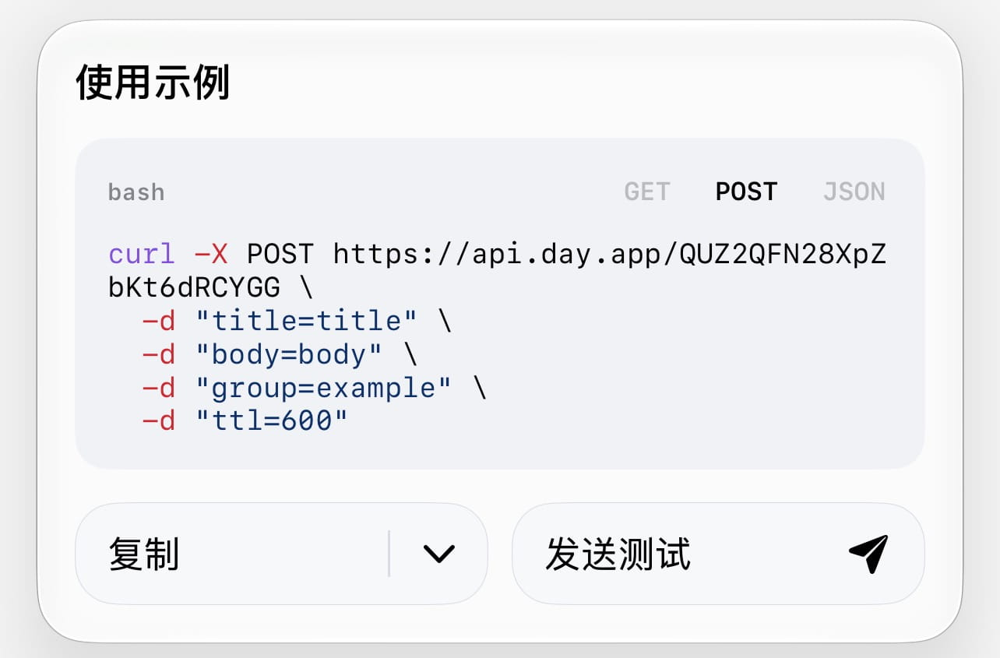

## Sending Push Notifications
1. Open the APP, copy the test command 


2. Modify the example to suit your needs. Once the command is executed, your device will receive the push notification.
3. Feel free to use any method you prefer to send requests; Bark does not impose any restrictions.

## URL Format
The push URL consists of the push key, parameter title, parameter subtitle, and parameter body. There are three formats:

```
/:key/:body 
/:key/:title/:body 
/:key/:title/:subtitle/:body 
```

POST requests can also use the following path, with all parameters placed in the request body:
```
/push
```

## Request Methods
##### GET request parameters are appended to the URL, for example:
```sh
curl https://api.day.app/your_key/body?group=groupName&copy=copyText
```
*When manually appending parameters to the URL, please pay attention to URL encoding issues.*

##### POST request parameters are placed in the request body, for example:
```sh
curl -X POST https://api.day.app/your_key \
     -d'body=body&group=groupName&copy=copyText'
```
##### POST requests support JSON, for example:
```sh
curl -X "POST" "https://api.day.app/your_key" \
     -H 'Content-Type: application/json; charset=utf-8' \
     -d $'{
  "body": "Test Body",
  "title": "Test Title",
  "badge": 1,
  "sound": "minuet",
  "icon": "https://day.app/assets/images/avatar.jpg",
  "group": "test",
  "url": "https://bark.day.app"
}'
```

##### The key can be placed in the request body, with the URL path set to /push, for example:
```sh
curl -X "POST" "https://api.day.app/push" \
     -H 'Content-Type: application/json; charset=utf-8' \
     -d '{
  "body": "Test Body",
  "title": "Test Title",
  "device_key": "your_key"
}'
```

#### MCP
VS Code:  
```js
{
  "servers": {
    "bark": {
      "type": "http",
      "url": "https://api.day.app/mcp/{key}"
    }
  }
}
```

Claude Code:   
```sh
claude mcp add bark --transport http https://api.day.app/mcp/{key}
```  
or  
```js
{
  "mcpServers": {
    "bark": {
      "type": "http",
      "url": "https://api.day.app/mcp/{key}"
    }
  }
}
```  
> Note: Replace {key} in the URL with your own key.


## Request Parameters
All supported parameters, their values and detailed descriptions are on the [Parameters](/en-us/params) page.

## Applications and Plugins Supporting Bark
* [SmsForwarder](https://github.com/pppscn/SmsForwarder) Monitors SMS, calls, and app notifications on Android devices and forwards them to Bark based on rules.
* [acme.sh](https://github.com/acmesh-official/acme.sh/wiki/notify#16-set-notification-for-ios-bark) Generates free certificates from ZeroSSL, Let’s Encrypt, and other CAs; Bark can be used to receive acme.sh cronjob notifications.
* [Uptime-Kuma](https://github.com/louislam/uptime-kuma) A self-hosted monitoring tool that supports Bark as an alert channel.
* [Apprise](https://github.com/caronc/apprise) Sends notifications to almost all platforms and supports Bark.
* [Browser Extension](https://github.com/ij369/bark-sender) Sends webpage content to your phone.
* [RevenueBell](https://github.com/woxiqingxian/RevenueBell) A tool for indie developers that pushes Apple subscription, renewal, and purchase revenue events to your phone via Bark.

## Shortcuts
Bark supports sending notifications directly via Shortcuts.
